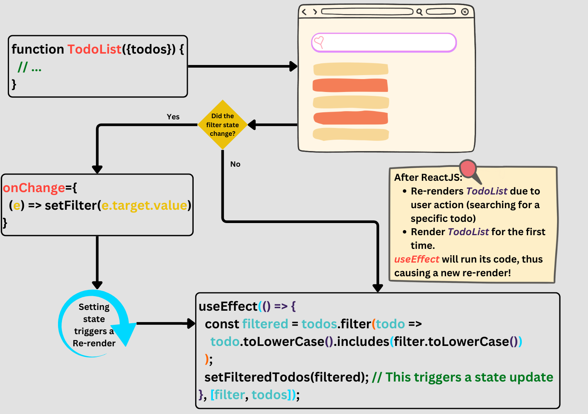
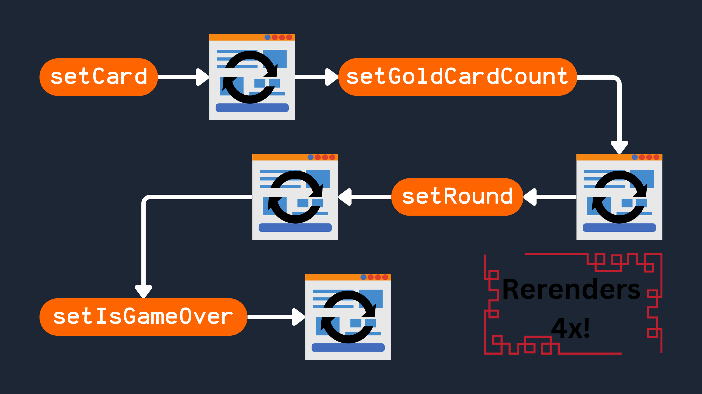

# Table of content

[Go back to main page](../../index.md).

- [Intro](#intro).
- [Remove unnecessary `useEffect`s](#remove-unnecessary-useeffects).
- [Remove unnecessary states](#remove-unnecessary-state).
- [Memoize expensive calculation](#memoize-expensive-calculation).
- [When to not use `useMemo`/`useCallback`](#when-to-not-use-usememousecallback).

## Intro

By doing the followings your ReactJS app will be more performant, easier to develop and maintain, and simpler to onboard new devs.

## Remove unnecessary `useEffect`s

1. I wanna emphasis on [this golden rule](./hooks.md#goldenRuleForDecidingOnUsingUseEffect) about when to use `useEffect` hook in your ReactJS app.
2. Most performance problems in ReactJS apps are caused by chains of updates originating from `useEffect`s that cause your components to render over and over.

### First scenario -- transforming data

Assume in this TodoList component we are filtering the list we got from parent component in a `useEffect`.

| Works but is not optimized                                                                                                                           | Works and is optimized                                                                                                                             |
| ---------------------------------------------------------------------------------------------------------------------------------------------------- | -------------------------------------------------------------------------------------------------------------------------------------------------- |
| https://github.com/kasir-barati/react/blob/91bcb401110cde1aab3b62cb1ba388c2bb9899b5/.github/docs/examples/todo-list-inefficient-useEffect.jsx#L1-L32 | https://github.com/kasir-barati/react/blob/6329a64acce7dc247fcb4c11002fdda88e50706f/.github/docs/examples/todo-list-efficient-useEffect.jsx#L1-L27 |

And here is what will happen:

### Second scenario -- resetting state

1. We've got a `ProfilePage` component.
2. It receives a `userId` prop.
3. You can write a comment in that page as that user (we have a state called `comment`).
4. If you switch from one profile to another.
5. The comment state does not get reset.
6. It is easy to accidentally post a comment on a wrong user's profile.

Here are two solutions to this problem (clearing the comment field automatically when navigating between profiles):

| Inefficient code                                                                                                                                           | Efficient code                                                                                                                                      |
| ---------------------------------------------------------------------------------------------------------------------------------------------------------- | --------------------------------------------------------------------------------------------------------------------------------------------------- |
| https://github.com/kasir-barati/react/blob/7c1f5982aa52ba692d94fb7339aba2f6e31e3b04/.github/docs/examples/profile-page-wrong-usage-of-useEffect.jsx#L1-L13 | https://github.com/kasir-barati/react/blob/7c1f5982aa52ba692d94fb7339aba2f6e31e3b04/.github/docs/examples/profile-page-corrected-version.jsx#L1-L17 |

> [!TIP]
>
> - Normally, ReactJS preserves the state when the same component is rendered in the same spot.
> - By passing `userId` as a key to the Profile component, you’re asking ReactJS to treat two Profile components with different `userId` as two different components that should not share any state.

### Third scenario -- adjusting state based on prop

1. `List` component receives a list of items as a prop.
2. It maintains the selected item in the `selectedItem` state variable.
3. We need to reset the `selectedItem` to `null` whenever the items prop receives a different array.

| Suboptimal                                                                                                                                      | Better                                                                                                                                              | Optimal                                                                                                                                              |
| ----------------------------------------------------------------------------------------------------------------------------------------------- | --------------------------------------------------------------------------------------------------------------------------------------------------- | ---------------------------------------------------------------------------------------------------------------------------------------------------- |
| https://github.com/kasir-barati/react/blob/7aa8f40445d394328f256db070e35f40fcdaefa2/.github/docs/examples/reset-state-with-useEffect.jsx#L1-L12 | https://github.com/kasir-barati/react/blob/7aa8f40445d394328f256db070e35f40fcdaefa2/.github/docs/examples/reset-state-with-another-state.jsx#L1-L14 | https://github.com/kasir-barati/react/blob/36dfc45d0144829c7469950a19b269ced738d720/.github/docs/examples/reset-state-without-extra-state.jsx#L1-L10 |

> [!CAUTION]
>
> Our better solution is:
>
> 1. Hard to understand because we are storing information from previous renders.
> 2. ReactJS only lets you update the same component’s state during a render.
> 3. Avoid loops with `items !== prevItems` condition.
> 4. Keep your component pure: beside this particular case you should not write other side effects in a event handler or `useEffect`.

### Forth scenario -- chaining `useEffect`s

So you are tempted to chain `useEffect`s in order to implement a logic:

| Fragile code                                                                                                                                 | Rock-solid code                                                                                                                               |
| -------------------------------------------------------------------------------------------------------------------------------------------- | --------------------------------------------------------------------------------------------------------------------------------------------- |
| https://github.com/kasir-barati/react/blob/08b54edd05ca981a9014c9ea4371911db3bddba4/.github/docs/examples/chained-useEffect-hooks.jsx#L1-L42 | https://github.com/kasir-barati/react/blob/9a7eef0e749885c2a0cbddbd8ba25ac0d9ed6648/.github/docs/examples/no-chaining-of-useEffect.jsx#L1-L36 |

Here is how ReactJS behaves in the worst case scenario:

> [!NOTE]
>
> There are cases where you cannot calculate the next state directly in the event handler. Imagine:
>
> 1. you have multiple dropdowns in different components.
> 2. They are shown to the user one after another.
> 3. The first dropdown lets the user select a country.
> 4. The second dropdown dynamically fetches cities based on the selected country.
>
> Here a chain of `useEffect`s is appropriate because you are synchronizing with network.

### Fifth scenario -- use `useSyncExternalStore` instead

- Your components needs to subscribe to built-in browser API data which is outside of the ReactJS state.
- You need to manually subscribe your components to it (ReactJS know nothing of it).

| Bad practice                                                                                                                                      | Recommended approach                                                                                                                                           |
| ------------------------------------------------------------------------------------------------------------------------------------------------- | -------------------------------------------------------------------------------------------------------------------------------------------------------------- |
| https://github.com/kasir-barati/react/blob/ae9872016f40c0538437c9a9e957a0a9ce039b98/.github/docs/examples/useEffect-sync-with-isOnline.jsx#L1-L32 | https://github.com/kasir-barati/react/blob/ae9872016f40c0538437c9a9e957a0a9ce039b98/.github/docs/examples/useSyncExternalStore-instead-of-useEffect.jsx#L1-L28 |

### Sixth scenario -- do not mix side-effects

- Resist adding unrelated logic to your `useEffect` only because this logic needs to run at the same time as an Effect you already wrote.
- E.g., let's say you want to

  - Send an analytics event when the user visits the `ChatRoom`.
  - You already have an `useEffect` that depends on `roomId`.
  - You might feel tempted to add the analytics call there too.

| Bad                                                                                                                                            | Good                                                                                                                                                    |
| ---------------------------------------------------------------------------------------------------------------------------------------------- | ------------------------------------------------------------------------------------------------------------------------------------------------------- |
| https://github.com/kasir-barati/react/blob/c4d9b9cf5e800b0389fa7579a36fcd96130527bd/.github/docs/examples/mixed-logics-in-useEffect.jsx#L1-L14 | https://github.com/kasir-barati/react/blob/c4d9b9cf5e800b0389fa7579a36fcd96130527bd/.github/docs/examples/logics-separated-in-two-useEffects.jsx#L1-L16 |

- In the above example, deleting one `useEffect` would not break the other `useEffect`'s logic.
- A good indication that they synchronize different things, and so it made sense to split them up.
- On the other hand, if you split up a cohesive piece of logic into separate Effects:
  - The code may look "cleaner" but will be more difficult to maintain.
  - This is why you should think whether the processes are same or separate.
  - Not whether the code looks cleaner.

> [!NOTE]
>
> Each `useEffect` in your code should represent a separate and independent synchronization process.

## Remove unnecessary state

- When something can be calculated from the existing props or state, do not put it in state. Instead, calculate it during rendering.

## [Memoize](./glossary.md#memoizationGlossary) expensive calculation

> [!TIP]
>
> In order to get a realistic sense of what's actually slowing down your app you need to:
>
> 1. Run ReactJS in production mode.
> 2. Disable [React Developer Tools](https://chromewebstore.google.com/detail/react-developer-tools/fmkadmapgofadopljbjfkapdkoienihi?hl=en).
> 3. Use devices similar to the ones your app's users have.

### First scenario -- recalculation

| Not optimized                                                                                                                             | Optimized                                                                                                                                   |
| ----------------------------------------------------------------------------------------------------------------------------------------- | ------------------------------------------------------------------------------------------------------------------------------------------- |
| https://github.com/kasir-barati/react/blob/79fdaa4b8b3a01bd3b3d4e496dbebdb58172e431/.github/docs/examples/todo-list-no-useMemo.jsx#L1-L10 | https://github.com/kasir-barati/react/blob/79fdaa4b8b3a01bd3b3d4e496dbebdb58172e431/.github/docs/examples/todo-list-with-useMemo.jsx#L1-L13 |

- `getFilteredTodos` is slow, or maybe we have a lot of todos.
- We should not recalculate `getFilteredTodos` for each new rerender.

## When to not use `useMemo`/`useCallback`

In apps with many small, isolated updates, you’ll likely find both [`useMemo`](./hooks.md#usememo) and [`useCallback`](./hooks.md#usecallback) useful to keep things responsive.

In contrast, apps with [larger updates](./glossary.md#webAppsWithLargeUpdates) generally do **NOT** benefit much from these hooks, as the benefit of memoizing values or functions becomes negligible.

> [!NOTE]
>
> There are scenarios where we cannot avoid using `useCallback`. Like [here](./hooks.md#optimizing-a-search-box-with-usecallback). So this suggestion is not a divine decree or gospel truth ;).

### Principles that help you to remove unnecessary memoizations

You can see different scenarios on how memoization can work [here in this codesandbox](https://codesandbox.io/p/sandbox/dreamy-ace-qq7xtg). And here are some pointers without going into details and showing any example:

1. A component visually wraps other components.

   Accept JSX as children in that wrapper component.

   If the wrapper component updates its own state.

   ReactJS knows that its children do **NOT** need to rerender unless their props where affected.

2. Prefer local state.

   Do **NOT** [lift state up](./state.md#lifting-state-up) any further than necessary.

3. Keep your rendering logic pure.

   If re-rendering a component causes a problem or produces some noticeable [visual artifact](./glossary.md#visualArtifactGlossary).

   It's a bug in your component!

   Fix the bug instead of adding memoization.

4. [Avoid unnecessary `useEffect`s](#remove-unnecessary-useeffects) that update state like what we've discussed [here](#first-scenario----transforming-data).
5. Remove unnecessary dependencies.

   E.g., instead of memoization, it's often simpler to move some object/function inside an `useEffect` or outside the component.

### How to find out which components benefit the most from memoization

Use [Google Chrome's Profiler](https://chromewebstore.google.com/detail/react-developer-tools/fmkadmapgofadopljbjfkapdkoienihi?hl=en) to debug your ReactJS app:

1. Open devTools and move to the Profiler tab.
2. Open your app in the browser and check Profiler tab.
3. You should be able to see each components and decide to optimize that component further.
