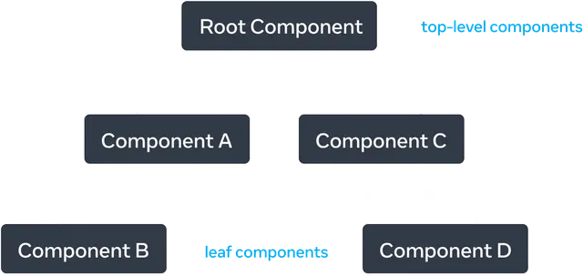

# Components

- Isolated pieces of UI.
- UI is built from small units like buttons, text, and images.
- ReactJS apps are made out of components.

  

- Can be as small as a button, or as large as an entire page.

  

- JavaScript functions that return markup.

  ```tsx
  // SubscribeButton.component.jsx
  export function SubscribeButton() {
    return <button>Subscribe to newsletter!</button>;
  }
  ```

- Can be imported and reused:

  ```tsx
  import { SubscribeButton } from 'SubscribeButton.component.jsx';

  export default function App() {
    return (
      <section>
        <h1>Welcome to my weblog</h1>
        <SubscribeButton />
      </section>
    );
  }
  ```

  > [!NOTE]
  >
  > `App` here is the **parent component** and `SubscribeButton` is the child component.

  > [!CAUTION]
  >
  > Do not nest a component definition inside another component. Why not?
  >
  > 1. Super slow.
  > 2. Causes bugs.
  >
  > ```tsx
  > export default function App() {
  >   function SubscribeButton() {}
  >   // ...
  > }
  > ```

- ReactJS component names must always start with a capital letter (PascalCase naming convention). If your component name does not start with a capital letter it won't work.
- The markup syntax you’ve seen above is called [`JSX`](./jsx.md).
- Components can store information temporarily. For this we use [states](./state.md).

## Props

- Can pass properties to a component, things like objects, arrays, functions, and even JSX:

  ```tsx
  function Button({ text, onClick }) {
    return <button onClick={onClick}>{text}</button>;
  }
  ```

  This syntax is called “destructuring”.

- To specify a default value for a prop: `Button({ text = 'button', onClick = () => {} })`

  > [!NOTE]
  >
  > The default value is only used if the size prop is missing or `text={undefined}`.
  >
  > **BUT** if you pass `text={null}` or `text={''}`, it will use null, or empty string respectively.

- `children` prop is what's inside that component:

  ```tsx
  export function Profile({ children, person }) {
    return (
      <section>
        <h1>{person.name}</h1>
        <p>{person.bio}</p>
        <time>{new Date(person.createdAt).toLocaleDateString()}</time>
        {children}
      </section>
    );
  }
  ```

  And then you can pass anything as its children:

  ```tsx
  <Profile person={{ name: 'Mohammad Jawad', bio: 'Lorem ipsum' }}>
    <Button text="Book an appointment" />
  </Profile>
  ```

  

- Props reflect a component’s data at any point in time, rather than only in the beginning. In other word if you change a prop value in parent component the child will change, and reflect new values.

  > [!NOTE]
  >
  > Props are immutable (read-only). Children should not change their props.

- JS garbage collector will take care of old and no longer needed props.

## Pure components

- AKA Dumb components, presentational components.
- It does not change any objects or variables that existed before it was called.
- Same inputs, same output.
- In other word they are the counterpart of pure function in functional programming.
- Try to have as many as possible. Less headache while debugging.

> [!NOTE]
>
> ReactJS wraps your entire app in a component called `StrictMode`. This component will render your components twice, thus ensuring that none of your components have any side effect (are impure).

> [!IMPORTANT]
>
> It’s completely fine to change variables and objects that you’ve just created while rendering. The ones that are inside the components body;
>
> ```tsx
> function Alert({ message }) {
>   return <p className="alert">{message}</p>;
> }
> export default function Notifications() {
>   const alerts = [];
>
>   for (let i = 1; i <= 12; i++) {
>     alerts.push(<Alert key={i} message={`Alert #${i}`} />);
>   }
>
>   return alerts;
> }
> ```
>
> This called "local mutation".

### Side effects

- Updating the screen, starting an animation, changing the data.
- [Event handlers](./events.md) don’t need to be pure.
- Cannot find the right event handler for your side effect? Attach it to your returned JSX with a `useEffect` call.

  > [!NOTE]
  >
  > This approach should be your last resort.

> [!IMPORTANT]
>
> Rendering can happen at any time, so components should not depend on each others' rendering sequence.

### Its benefits

1. Components can be used in a different environment.
2. Skip rendering components whose inputs have not changed. This is safe because pure functions always return the same results, so they are safe to cache.
3. In the middle of rendering. Some data changes, restart rendering without wasting time to finish the outdated render.

## Leaf components and top-level components

- Top-level components:
  - Often contain the most complexity.
  - Components nearest to the root component.
  - Affect the rendering performance of all the components beneath them.
- Leaf components: components with no child components. They are mostly dumb component too, but it not necessarily always the case.

  

- Useful for understanding:

  1. Data flow.
  2. Rendering performance.
  3. Relationship between components.

### Render tree

- components are composed of other components (we nest them). While rendering a ReactJS app, this relationship is modeled in a tree.


- Nodes: each component: App, Table, Cell, to name a few.
- Root node:
  - The root component of the app. In this case App.
  - The first component ReactJS renders.
- Each arrow in the tree points from a parent component to a child component.

#### Where are HTML elements?

- HTML markup is a UI primitives.
- ReactJS, as a UI framework, is platform agnostic, meaning:
  - Render tree is only composed of ReactJS components.
  - Render tree provides insight to our ReactJS app regardless of what platform your app renders to.

## Default vs named exports

| Syntax  | Export statement                      | Import statement                        |
| ------- | ------------------------------------- | --------------------------------------- |
| Default | `export default function Button() {}` | `import Button from './Button.js';`     |
| Named   | `export function Button() {}`         | `import { Button } from './Button.js';` |

- There are scenarios where you'll be better of using default export. E.g. lazy loading, read [this Q&A on reddit](https://www.reddit.com/r/reactjs/comments/15xvavb/how_do_you_lazy_load_a_named_export_with_react/).

### Conventions

- I personally prefer to export leaf components as named export.
- Some use default exports if the file exports only one component, and use named exports if it exports multiple components and values.
- Some teams choose to only stick to one style (default or named).
- Another approach can be avoiding mixing default export and named export in a single file.

## Modularity

Why multiple separate files?

- Debugging.
- Reusability.
- Maintenance.
- Unit testing.
- Separation of concerns.

> [!TIP]
>
> You might hear that this module is not cohesive or is. What they mean by cohesive? That component do one thing well.

## Module dependency tree


- Nodes represent a JS module.
- Useful to determine what modules are necessary to run your ReactJS app (bundler uses this piece of info).

## How ReactJS updates the DOM

- Before your components are displayed on the screen, they must be rendered by ReactJS.
- Your components are cooks in the kitchen.
- ReactJS is the waiter who puts in requests from customers and brings them their orders.

### Steps

1. Triggering a render.

   - Occurs on:

     1. Component's initial render: `createRoot`.
     2. Component's (or one of its ancestors') state has been updated: `set*(newValue)`.

        > [!TIP]
        >
        > Sometimes a component's state changes, and that component is located very high in the [render tree](#render-tree). So it does not make sense to rerender all of its children. In these kind of scenarios we opt for optimizing our components.
        >
        > **But remember to not optimize prematurely (beforehand).**
        >
        > But to give you an idea of when you need to think in terms of improving performance of your ReactJS app why do not you look at [this code](https://github.com/kasir-barati/react/tree/490527078d8bc2847a0924dc307f7839cb2b3bca).

   

2. Rendering the component.

   - This process is recursive; it will render all components used, until it reaches the last one. So that it know exactly what should it display on screen.
   - **Must** be a [pure calculation](#pure-components).

   

3. Committing to the DOM.

   - For the initial render, ReactJS will use the [`appendChild()`](https://developer.mozilla.org/en-US/docs/Web/API/Node/appendChild).
   - ReactJS only changes the DOM nodes if there’s a difference between renders.
   - After ReactJS updates the DOM, browser will repaint the screen (what is called "browser rendering", learn more [here](https://developer.mozilla.org/en-US/docs/Web/Performance/How_browsers_work#render)).

   

## Prop drilling issue

- Normally you pass information from a parent component to a child component via props.
- But what if many components need the same information.
- Beside normal scenarios where we wanna use this feature I love [this use case](https://react.dev/learn/managing-state#passing-data-deeply-with-context) too: There we can just kinda use `Heading` component and it will automatically get its level from `Section` component which is its parent.
- Done through [`useContext`](./hooks.md#usecontext).
