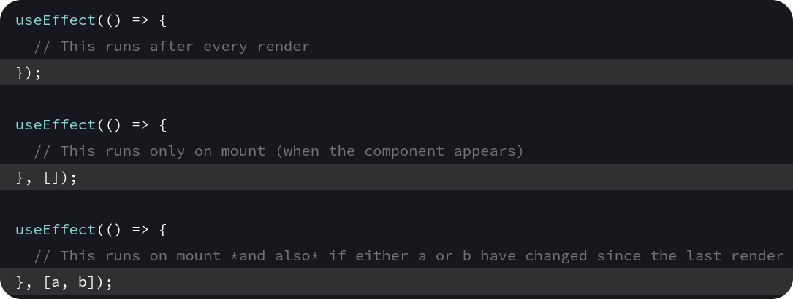
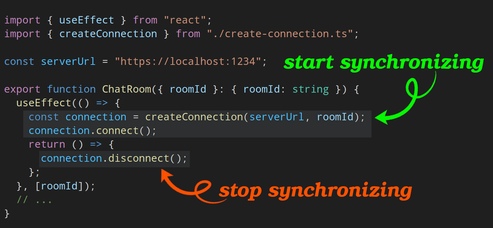
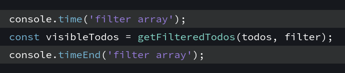
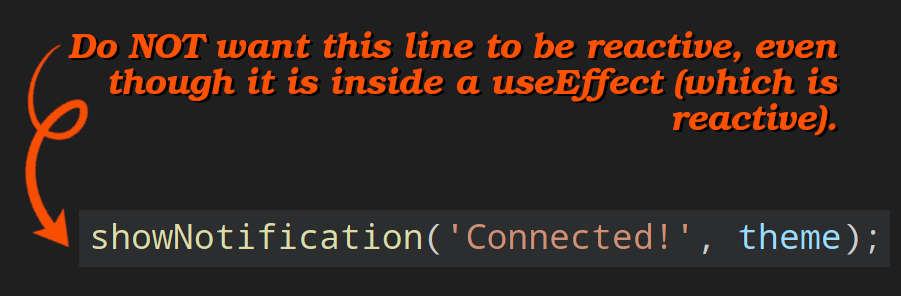

# React hooks

- Hooks are special functions that let your components use React features.
- We have two kind of component: stateful, and stateless.
- React components should be as much as possible stateless.
- By convention any function starting with `use`.
- They should be called at the **top level of your component**.
  - Hooks **CAN NOT** be called conditionally (`if (whatever) { useState() }` :x:).
  - You want to use `useState` in a condition or a loop, extract it into a new component.

## `useState`

- It creates a new _state_ + a state setter function.
  - Accepts the initial state when being called; `useState(/* initial state */)`.
  - Each time the component is called it creates an isolated state.
- The convention is to name _state_ variables like `[something, setSomething]`.

  > [!NOTE]
  >
  > This syntax is [array destructuring](https://developer.mozilla.org/en-US/docs/Web/JavaScript/Reference/Operators/Destructuring_assignment).

- Update it with `setCount(previousCount => previousCount + 1)` and not `setCount(count + 1)`. Because if we call the latter case twice it is not gonna increase it by two since the count stays the same value as it was while it got rendered.
- In `StrictMode`, React will call your initializer function twice in order to help you find accidental impurities. This is development-only behavior and does not affect production.
- [Examples](https://react.dev/reference/react/useState#examples-basic).
- Would not merge objects. Instead it overrides the _state_. In other word in _React_, _state_ is considered **read-only**, so you should **replace it rather than mutate**. Thus this will break your app:

  ```ts
  const [user, setUser] = useState({ age: 12, name: 'kasir' });
  function handleIncreaseAgeClick() {
    setUser((previousUser) => ({ age: previousUser.age + 1 }));
  }
  ```

  Here we loss our `name` property. So we need to specify all fields:

  ```ts
  setUser((previousUser) => ({
    ...previousUser,
    age: previousUser.age + 1,
  }));
  ```

- When to create an object and when to create a new state?
  - [Learn more](https://react.dev/learn/managing-state).
- Avoiding recreating the initial state; instead of `useState(createInitialTodos());` do this `useState(createInitialTodos);` ([learn more](https://react.dev/reference/react/useState#avoiding-recreating-the-initial-state)).
- Changing `key` attribute causes rerender in _React_ ([learn more](https://react.dev/reference/react/useState#resetting-state-with-a-key)).

## `useReducer`

- You have many state updates spread across many event handlers.
- Consolidate all the state update logic outside your component in a single function (`reducer`).
- Event handlers only specify the user "actions".
- You can utilize [discriminated unions](https://dev.to/kasir-barati/discriminated-unions-in-reactjs-5g25) in your code to have better typing.

## `useContext`

- To access a created context value.
- Related to [prop drilling issue](./components.md#prop-drilling-issue).
- Can combine this with [reducers](#usereducer) to manage complex states;
  - Read the states through `useContext` from anywhere deep within the render tree.
  - Dispatch events to keep them update.
- You can find an example of it [here](../../src/components/task-manager-context/TasksContext.component.tsx).

## `useRef`

- Your component stores <small>(kinda like state)</small> some information.
- Retained by React between rerenders <small>(unlike variable they do not lose their values between rerenders)</small>.
- **But** no rerender when it changes.
- React sets `ref.current` during the [commit phase](./components.md#steps).
- An "escape hatch" from ReactJS's one-way data flow Refs which should be **used sparingly**.

  ```ts
  const ref = useRef();
  console.log(ref.current);
  ```

- [An example on ReactJS doc](https://react.dev/learn/referencing-values-with-refs#example-building-a-stopwatch).
- Pseudo-code for `useRef` inside ReactJS:

  ```tsx
  function useRef(initialValue) {
    const [ref, unused] = useState({ current: initialValue });
    return ref;
  }
  ```

- A list of refs, like the [gallery component](../../src/components/gallery/Gallery.component.tsx) is a dynamic one that we wanna generate when ReactJS mounts our component. **But** we cannot call hooks inside a loop too. So what now?
  1. This is one possible solution: Define a single ref to their parent element. Then use `querySelectorAll` to find the individual child nodes from it
     - Brittle.
     - Can break if your markup changes.
  2. ref callback: Pass a function to the ref attribute. We have used this in our gallery component.

### Use cases / Dos

> [!CAUTION]
>
> Stick to non-destructive actions like focusing and scrolling.
>
> - If you need to modify, then make sure to do with parts of the **DOM that ReactJS has no reason to update**.

- Usually, you will access `ref`s from event handlers.
- Inside it you can store things that don’t impact the component’s rendering output. E.g.:

  - Timeout/interval IDs.
  - DOM elements:

    - ReactJS will put the corresponding DOM element into `inputRef.current`.
    - Once the element is removed from the DOM, ReactJS will update `inputRef.current` to be `null`.
    - Access to the DOM elements to focus on it, scroll to it, or measure its size and position:

      ```tsx
      const inputRef = useRef(null);
      // ...
      <>
        <input ref={inputRef} />
        {/* inputRef.current.scrollIntoView(); */}
        <button onClick={() => inputRef.current.focus()}>
          Focus the input
        </button>
      </>;
      ```

### Don'ts

- Do not use its value **during render**. It can lead to unexpected results. This code never shows an Off button.

  ```tsx
  import { useRef } from 'react';

  export default function Toggle() {
    const isOnRef = useRef(false);

    return (
      <button
        onClick={() => {
          isOnRef.current = !isOnRef.current;
        }}
      >
        {isOnRef.current ? 'On' : 'Off'}
      </button>
    );
  }
  ```

  > [!TIP]
  >
  > The only exception to this is is something that only sets the `ref` once during the first render:
  >
  > ```tsx
  > if (!ref.current) {
  >   ref.current = new Thing();
  > }
  > ```

- Do not access it during rendering of updates, the DOM nodes haven’t been updated yet. So it’s too early to read them.

  Before updating the DOM, ReactJS sets the affected `ref.current` values to `null`. After updating the DOM, ReactJS immediately sets them to the corresponding DOM nodes.

- Avoid changing DOM nodes managed by React.

### `forwardRef`

- ReactJS does not let a component access the DOM nodes of other components. Not even for its own children!
- Components that want to expose their DOM nodes have to opt in to that behavior.

```tsx
// MyInput.component.tsx
const MyInput = forwardRef((props, ref) => {
  return <input {...props} ref={ref} />;
});

// In another component:
<MyInput ref={inputRef} />;
```

> [!IMPORTANT]
>
> In design systems, it is a common pattern for:
>
> - Low-level components like `button`s, `input`s, and so on, to forward their `ref`s to their DOM nodes.
>   - If you need to restrict parent component from some APIs that will be accessible through ref you can take a look at `useImperativeHandle` [here](https://react.dev/learn/manipulating-the-dom-with-refs#exposing-a-subset-of-the-api-with-an-imperative-handle).
> - High-level components like forms, lists, or page sections usually won’t expose their DOM nodes to avoid accidental dependencies on the DOM structure.

## `useEffect`

- Synchronize with external systems:
  - Send an analytics log.
- Effects let you specify side effects that are **caused by rendering itself, rather than by a particular event**.
- E.g. in a social media application like Telegram sending a message in the chat is an event because it is directly caused by the user clicking a specific button. However, setting up a server connection is an effect because it should happen no matter which interaction caused the component to appear.
- Effects **run at the end of a commit** after the screen updates (learn more about commit [here](./components.md#steps)).

  In other word, **`useEffect` "delays" a piece of code from running until that render is reflected on the screen**.

### Two types of logic inside React components

1. **Rendering code** (pure):
   1. Get props, set states.
   2. Transform props, and states.
   3. Return appropriate JSX.
2. **Event handlers**:
   - Nested functions inside your components that do things rather than just calculate them. E.g.:
     - Update an input field.
     - Navigate the user to another screen.
     - Submit an HTTP POST request to buy a product.
   - Contain "side effects"; change the program's state caused by a specific user action (e.g. clicking on a button).

> [!TIP]
>
> When you ain't sure whether some code should be in a `useEffect` or in an event handler, ask yourself why this code needs to run. **Use `useEffect`s** only for code that should run **because the component was displayed to the user**. Otherwise go for event handlers.

### How to use `useEffect`

1. Define it: some code which runs after each commit.
2. Dependencies:

   - When ReactJS should rerun the code inside the `useEffect`:

     - Empty array <small>(<code>useEffect(() => {}, <b>[/* empty array */]</b>)</code>)</small> it will execute your code only once on first render.
     - **But** if you skip the second argument all together <small>(<code>useEffect(() => {})</code>)</small> ReactJS will execute your callback on each render!
     - A list of all the **reactive** values used by your `useEffect`'s code.

     

   - ReactJS will re-execute the callback function passed to it if the specified dependencies changes.

     Assume that you have a VPN web app and user can decide to which server they wanna connect, now here the parent component sends the `serverName` and our effect needs to reflect any change in the `serverName`.

     ```tsx
     export function Server({
       serverName,
     }: Readonly<{ serverName: string }>) {
       useEffect(() => {
         const serverUrl = getServerUrl(serverName);
         const connection = createConnection(serverUrl);
         connection.connect();
         return () => connection.disconnect();
       }, [serverName]);
       // ...
     }
     ```

   - ReactJS uses [`Object.is`](https://developer.mozilla.org/en-US/docs/Web/JavaScript/Reference/Global_Objects/Object/is) for comparing previous values of dependencies and the new ones.

   > [!NOTE]
   >
   > You cannot "choose" your dependencies, how you code determine what should go inside the dependency array; you'll get a linter error when you forget to specify dependencies of a `useEffect` hook. E.g. in the `Counter` component we are receiving interval from parent component and use it inside the `useEffect` hook.
   >
   > ```tsx
   > function Counter({ interval }) {
   >   const [count, setCount] = useState(0);
   >   useEffect(() => {
   >     const counterInterval = setInterval(function () {
   >       setCount((prev) => prev + 1);
   >     }, interval);
   >     return () => clearInterval(counterInterval);
   >   }, []);
   >   return <p>and the counter counts {count}</p>;
   > }
   > ```
   >
   > 

3. Clean up after ReactJS wants to unmount your component. E.g.

   - In a chat web app you need to establish a web socket connection to your backend and disconnect from it when the component is being unmounted:

     ```ts
     useEffect(() => {
       const connection = createWebsocketConnection();
       connection.connect();
       return () => connection.disconnect();
     }, []);
     ```

     Otherwise you'll pill up a lot of connections as user navigates in your app!

   - Close [modal](https://developer.mozilla.org/en-US/docs/Web/API/HTMLDialogElement/showModal) so that your app in dev env and prod works perfectly fine (remember that ReactJS in `StrictMode` render your component twice to catch potential bugs):

     ```tsx
     useEffect(() => {
       const dialog = dialogRef.current;
       dialog.showModal();
       return () => dialog.close();
     }, []);
     ```

   - Unsubscribe:

     ```tsx
     useEffect(() => {
       function handleScroll(e) {
         console.log(window.scrollX, window.scrollY);
       }

       window.addEventListener('scroll', handleScroll);

       return () =>
         window.removeEventListener('scroll', handleScroll);
     }, []);
     ```

   - Animations:

     ```tsx
     useEffect(() => {
       const node = ref.current;

       node.style.opacity = 1; // Trigger the animation

       return () => {
         node.style.opacity = 0; // Reset to the initial value
       };
     }, []);
     ```

   - On [fetching data](https://react.dev/learn/synchronizing-with-effects#fetching-data) abort the fetch or ignore its result. For a much better way to fetching data read [this](./fetching-data.md).
   - For sending analytics you most likely do not need to do anything and `logVisit` should not skew the production metrics.

     ```ts
     useEffect(() => {
       logVisit(url); // Sends a POST request
     }, [url]);
     ```

   > [!TIP]
   >
   > [This](https://react.dev/learn/synchronizing-with-effects#putting-it-all-together) is a very interesting example about cleanup functions and closures in the ReactJS doc.

### `useEffect` examples

A ReactJS component which accepts a `isPlaying` prop so it will tell HTML's `video` element that it should whether plays the video or not:

```tsx
import { useEffect, useRef } from 'react';

export function VideoPlayer({ src, isPlaying }) {
  const ref = useRef(null);

  useEffect(() => {
    if (isPlaying) {
      ref.current.play();
    } else {
      ref.current.pause();
    }
  }, [isPlaying]);

  return <video ref={ref} src={src} loop playsInline />;
}
```

> [!TIP]
>
> Why `ref` is missing from the dep array? Because ReactJS guarantees you'll always get the same object from the same `useRef` call on every render. So it will never by itself cause the Effect to re-run. Therefore no need to add it.
>
> Although you can add it too. And one other note, if parent component sends a ref prop, then you have to add it to your dep array since parent component might send different ref based on some conditions.
>
> **Please note that a mutable value like `ref.current` cannot be a dependency.**

"External system" here we synchronized with ReactJS state was the browser media API.

### Don'ts

Do not use `useEffect` when:

- If you want to adjust some state based on other state:

  ```tsx
  const [firstName, setFirstName] = useState('Taylor');
  const [lastName, setLastName] = useState('Swift');
  // Unnecessary Effect
  const [fullName, setFullName] = useState('');
  useEffect(() => {
    setFullName(firstName + ' ' + lastName);
  }, [firstName, lastName]);
  ```

- [Transforming data for rendering](./better-reactjs-app.md#first-scenario----transforming-data).
- Fetching data: for this specific case you can define your custom hook. Read [fetching data](./fetching-data.md) to learn more.
- To **handle user events**.
- Logics that should only run once when the application starts. You can put it outside your components.
- Things that cannot be cleaned up (undone):
- Buying a product:

  ```tsx
  useEffect(() => {
    // Wrong: This Effect fires twice in development, exposing a problem in the code.
    fetch('/api/buy', { method: 'POST' });
  }, []);
  ```

  This `useEffect` should be removed. Then you can add this logic to a button's event handler. This illustrates that if remounting breaks the logic of your application, this usually uncovers existing bugs.

- Do not add global/mutable values in your dep array:

  - A mutable value like `location.pathname` can’t be a dependency.
  - It's mutable, so it can change at any time completely outside of the ReactJS rendering data flow.
  - Changing it would not trigger a rerender of your component.
  - Even if you specified it in the dependencies, ReactJS would not know to re-synchronize the Effect when it changes.
  - This also breaks the rules of ReactJS; reading mutable data during rendering (which is when you calculate the dependencies) breaks [purity of rendering](./components.md#pure-components).
  - Instead, you should read and subscribe to an external mutable value with [`useSyncExternalStore`](#usesyncexternalstore).

> [!NOTE]
>
> Removing unnecessary Effects will make your code:
>
> 1. Easier to follow.
> 2. Faster to run.
> 3. Less error-prone.

### Lifecycle

> [!TIP]
>
> Think about each `useEffect` independently from your component's lifecycle.

1. Start synchronizing something.
2. Stop synchronizing it.



> [!TIP]
>
> - Do **NOT** think from the perspective of a component's lifecycle.
> - Rather, always focus on a single start/stop cycle at a time.
> - It should **NOT** matter whether a component is mounting, updating, or unmounting.
> - All you need to do is to describe how to start synchronization and how to stop it.
> - If you do it well, your `useEffect` will be resilient to being started and stopped as many times as it's needed.

> [!NOTE]
>
> Props, state, and other values declared inside the component are **reactive** because they're calculated during rendering and participate in the ReactJS data flow. That's why we skipped `serverUrl` and did not add it to the `useEffect`'s dep array. It is not gonna change. [Same logic as here for why we did not add `ref`](#useeffect-examples).

### A `useEffect` that re-runs in response to some values but not others

## `useMemo`

- The function you wrap in `useMemo` runs during rendering, so this only works for [pure calculations](./components.md#pure-components) -- no side-effect.
- How to tell if a calculation is expensive? add a `console.time` to measure the time spent in a piece of code:

  

  1. If the overall logged time adds up to a significant amount (say, `1ms` or more).
  2. Then it is probably a candidate to memoize.

- `useMemo` will not make the first render faster.
- Only helps your component to skip unnecessary work on updates.
- After using it it is a good idea to double check the performance of our app.
  1. Add the `console.time` again around the `useMemo`.
  2. Keep in mind that your machine is probably faster than your users's machine.
  3. Use artificial slowdowns like [_CPU Throttling_](https://developer.chrome.com/blog/new-in-devtools-61/#throttling).
- Measuring performance in dev env will not give you the most accurate results.

## `useSyncExternalStore`

- A purpose-built hook for subscribing to an external store.

## `useEffectEvent`

> [!CAUTION]
>
> This API is experimental and is **NOT** available in a stable version of ReactJS yet.
>
> **Experimental versions of React may contain bugs. Don’t use them in production**.
>
> You can try it by upgrading ReactJS packages to the most recent experimental version:
> `react@experimental`, `react-dom@experimental`, `eslint-plugin-react-hooks@experimental`.

- Help us to separate non-reactive logic from the reactive `useEffect`'s logic.
- Showing a notification to the user is a good example:

  ```tsx
  import { useState, useEffect } from 'react';
  import { createConnection } from './create-connection';
  import { showNotification } from './notifications.js';

  const serverUrl = 'https://localhost:1234';

  export function ChatRoom({ roomId, theme }) {
    useEffect(() => {
      const connection = createConnection(serverUrl, roomId);
      connection.on('connected', () => {
        showNotification('Connected!', theme);
      });
      connection.connect();
      return () => connection.disconnect();
    }, [roomId, theme]);

    return <h1>Welcome to the {roomId} room!</h1>;
  }
  ```

  When the `roomId` changes, the chat re-connects as you would expect. But since `theme` is also a dependency, the chat also re-connects every time you switch between the dark and the light `theme`!

  

  So here is how we can separate non-reactive part from react part in ReactJS:

  ```tsx
  import { useEffect, useEffectEvent } from 'react';
  export function ChatRoom({ roomId, theme }) {
    // The logic inside the callback passed to the useEffectEvent is not reactive.
    // It always "sees" the latest values of your props and state.
    const onConnected = useEffectEvent(() => {
      showNotification('Connected!', theme);
    });

    useEffect(() => {
      const connection = createConnection(serverUrl, roomId);
      connection.on('connected', () => {
        onConnected();
      });
      connection.connect();
      return () => connection.disconnect();
    }, [roomId]);

    // ...
  }
  ```

  > [!NOTE]
  >
  > All dependencies declared, no need to include `onConnected`. It ain't reactive and **MUST** be omitted from dependencies array.

- Very similar to event handlers.
- Are triggered by you from within `useEffect`s.
- Lets you "break the chain" between the reactivity of `useEffect`s and code that should not be reactive.

  In other word **only apply it to the lines of code that you do NOT wanna be reactive**.

### Don'ts

- Only call them from inside Effects.
- Never pass them to other components or Hooks.

  | Wrong                                                                                                                                       | Correct                                                                                                                                        |
  | ------------------------------------------------------------------------------------------------------------------------------------------- | ---------------------------------------------------------------------------------------------------------------------------------------------- |
  | https://github.com/kasir-barati/react/blob/28e8d99b6c434213c0d0ff7495aaabc95262a613/.github/docs/examples/passing-useEffectEvent.jsx#L1-L24 | https://github.com/kasir-barati/react/blob/28e8d99b6c434213c0d0ff7495aaabc95262a613/.github/docs/examples/no-passing-useEffectEvent.jsx#L1-L24 |

## Custom hook

> [!TIP]
>
> You should be writing less `useEffect` hooks and more composable, reusable custom hooks.

- Fetching data from external resources:

  ```tsx
  import { useState, useEffect } from 'react';

  export function useFetch<DataType, ErrorType = any>(url: string) {
    const [data, setData] = useState<DataType | null>(null);
    const [loading, setLoading] = useState(true);
    const [error, setError] = useState<ErrorType | null>(null);

    useEffect(() => {
      const fetchData = async () => {
        try {
          const response = await fetch(url);
          if (!response.ok) {
            throw new Error('Error fetching data');
          }
          const result = await response.json();
          setData(result);
        } catch (err) {
          setError(err.message);
        } finally {
          setLoading(false);
        }
      };

      fetchData();
    }, [url]);

    return { data, loading, error };
  }
  ```
