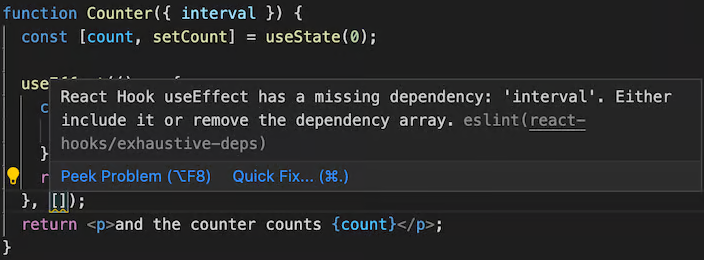

# React hooks

- Hooks are special functions that let your components use React features.
- We have two kind of component: stateful, and stateless.
- React components should be as much as possible stateless.
- By convention any function starting with `use`.
- They should be called at the **top level of your component**.
  - Hooks **CAN NOT** be called conditionally (`if (whatever) { useState() }` :x:).
  - You want to use `useState` in a condition or a loop, extract it into a new component.

## `useState`

- It creates a new _state_ + a state setter function.
  - Accepts the initial state when being called; `useState(/* initial state */)`.
  - Each time the component is called it creates an isolated state.
- The convention is to name _state_ variables like `[something, setSomething]`.

  > [!NOTE]
  >
  > This syntax is [array destructuring](https://developer.mozilla.org/en-US/docs/Web/JavaScript/Reference/Operators/Destructuring_assignment).

- Update it with `setCount(previousCount => previousCount + 1)` and not `setCount(count + 1)`. Because if we call the latter case twice it is not gonna increase it by two since the count stays the same value as it was while it got rendered.
- In `StrictMode`, React will call your initializer function twice in order to help you find accidental impurities. This is development-only behavior and does not affect production.
- [Examples](https://react.dev/reference/react/useState#examples-basic).
- Would not merge objects. Instead it overrides the _state_. In other word in _React_, _state_ is considered **read-only**, so you should **replace it rather than mutate**. Thus this will break your app:

  ```ts
  const [user, setUser] = useState({ age: 12, name: 'kasir' });
  function handleIncreaseAgeClick() {
    setUser((previousUser) => ({ age: previousUser.age + 1 }));
  }
  ```

  Here we loss our `name` property. So we need to specify all fields:

  ```ts
  setUser((previousUser) => ({
    ...previousUser,
    age: previousUser.age + 1,
  }));
  ```

- When to create an object and when to create a new state?
  - [Learn more](https://react.dev/learn/managing-state).
- Avoiding recreating the initial state; instead of `useState(createInitialTodos());` do this `useState(createInitialTodos);` ([learn more](https://react.dev/reference/react/useState#avoiding-recreating-the-initial-state)).
- Changing `key` attribute causes rerender in _React_ ([learn more](https://react.dev/reference/react/useState#resetting-state-with-a-key)).

## `useReducer`

- You have many state updates spread across many event handlers.
- Consolidate all the state update logic outside your component in a single function (`reducer`).
- Event handlers only specify the user "actions".
- You can utilize [discriminated unions](https://dev.to/kasir-barati/discriminated-unions-in-reactjs-5g25) in your code to have better typing.

## `useContext`

- To access a created context value.
- Related to [prop drilling issue](./components.md#prop-drilling-issue).
- Can combine this with [reducers](#usereducer) to manage complex states;
  - Read the states through `useContext` from anywhere deep within the render tree.
  - Dispatch events to keep them update.
- You can find an example of it [here](../../src/components/task-manager-context/TasksContext.component.tsx).

## `useRef`

- A component remember <small>(kinda like state)</small> some information.
- Retained by React between rerenders <small>(unlike variable they do not lose their values between rerenders)</small>.
- **But** no rerender when it changes.

### Use cases

Store things that don’t impact the component’s rendering output. E.g.:

- timeout IDs.
- DOM elements:

  - Access to the DOM elements to focus on it, scroll to it, or measure its size and position:

    ```tsx
    const inputRef = useRef(null);
    // ...
    <>
      <input ref={inputRef} />
      <button onClick={() => inputRef.current.focus()}>
        Focus the input
      </button>
    </>;
    ```

## `useEffect`

- Synchronize with external systems:
  - Send an analytics log.
- Runs some code after rendering.
- The second argument is the dependencies:

  - Dependency list is a list of all the **reactive** values used by your `useEffect`'s code.

    > [!TIP]
    >
    > How you code determine what should go inside the dependency array.

  - ReactJS will re-execute the callback function passed to it if the specified dependencies changes.

    Assume that you have a VPN web app and user can decide to which server they wanna connect, now here the parent component sends the `serverName` and our effect needs to reflect any change in the `serverName`.

    ```tsx
    export function Server({
      serverName,
    }: Readonly<{ serverName: string }>) {
      useEffect(() => {
        const serverUrl = getServerUrl(serverName);
        const connection = createConnection(serverUrl);
        connection.connect();
        return () => connection.disconnect();
      }, [serverName]);
      // ...
    }
    ```

    > [!NOTE]
    >
    > You'll get a linter error when you forget to specify dependencies of a `useEffect` hook. E.g. in the `Counter` component we are receiving interval from parent component and use it inside the `useEffect` hook.
    >
    > ```tsx
    > function Counter({ interval }) {
    >   const [count, setCount] = useState(0);
    >   useEffect(() => {
    >     const counterInterval = setInterval(function () {
    >       setCount((prev) => prev + 1);
    >     }, interval);
    >     return () => clearInterval(counterInterval);
    >   }, []);
    >   return <p>and the counter counts {count}</p>;
    > }
    > ```
    >
    > 

  - If you pass empty array <small>(`useEffect(() => {}, [])`)</small> it will execute your code only once on first render.
  - **But** if you skip the second argument all together <small>(`useEffect(() => {})`)</small> ReactJS will execute your callback on each render!

- Do clean up after ReactJS wants to unmount your component. E.g. in a chat web app you need to establish a web socket connection to your backend and disconnect from it when the component is being unmounted:

  ```ts
  useEffect(() => {
    const connection = createWebsocketConnection();
    connection.connect();
    return () => connection.disconnect();
  }, []);
  ```

### Don'ts

Do not use `useEffect` when:

- If you want to update a component's state when some props or state changes.

  ```tsx
  const [firstName, setFirstName] = useState('Taylor');
  const [lastName, setLastName] = useState('Swift');
  // Unnecessary Effect
  const [fullName, setFullName] = useState('');
  useEffect(() => {
    setFullName(firstName + ' ' + lastName);
  }, [firstName, lastName]);
  ```

- Transforming data for rendering.
- Fetching data: for this specific case you can define your custom hook.
- To **handle user events**.

> [!NOTE]
>
> Removing unnecessary Effects will make your code:
>
> 1. Easier to follow.
> 2. Faster to run.
> 3. Less error-prone.

### Lifecycle

1. Start synchronizing something.
2. Stop synchronizing it.

## Custom hook

> [!TIP]
>
> You should be writing less `useEffect` hooks and more composable, reusable custom hooks.

- Fetching data from external resources:

  ```tsx
  import { useState, useEffect } from 'react';

  export function useFetch<DataType, ErrorType = any>(url: string) {
    const [data, setData] = useState<DataType | null>(null);
    const [loading, setLoading] = useState(true);
    const [error, setError] = useState<ErrorType | null>(null);

    useEffect(() => {
      const fetchData = async () => {
        try {
          const response = await fetch(url);
          if (!response.ok) {
            throw new Error('Error fetching data');
          }
          const result = await response.json();
          setData(result);
        } catch (err) {
          setError(err.message);
        } finally {
          setLoading(false);
        }
      };

      fetchData();
    }, [url]);

    return { data, loading, error };
  }
  ```
