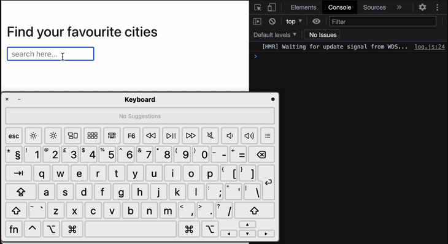
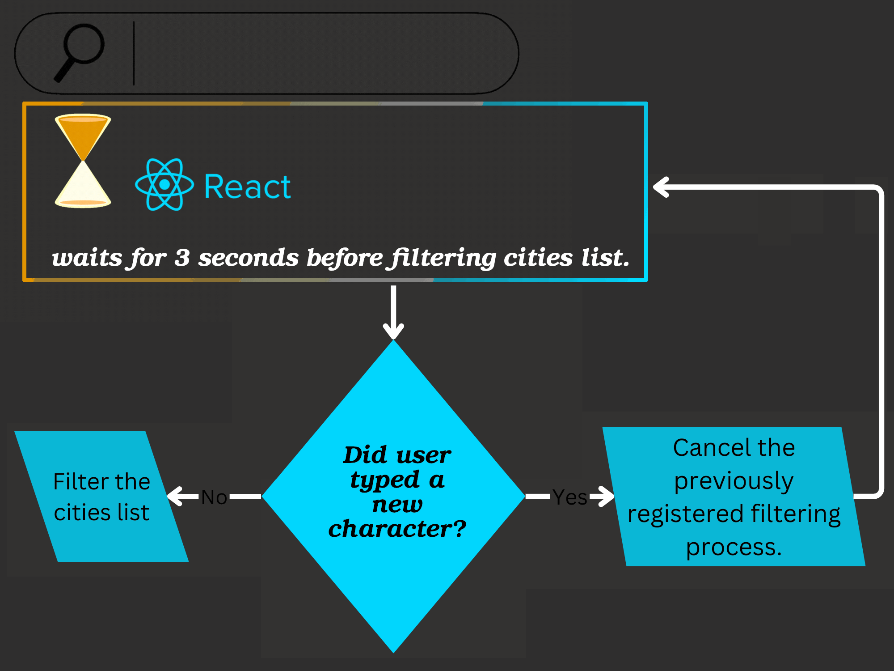
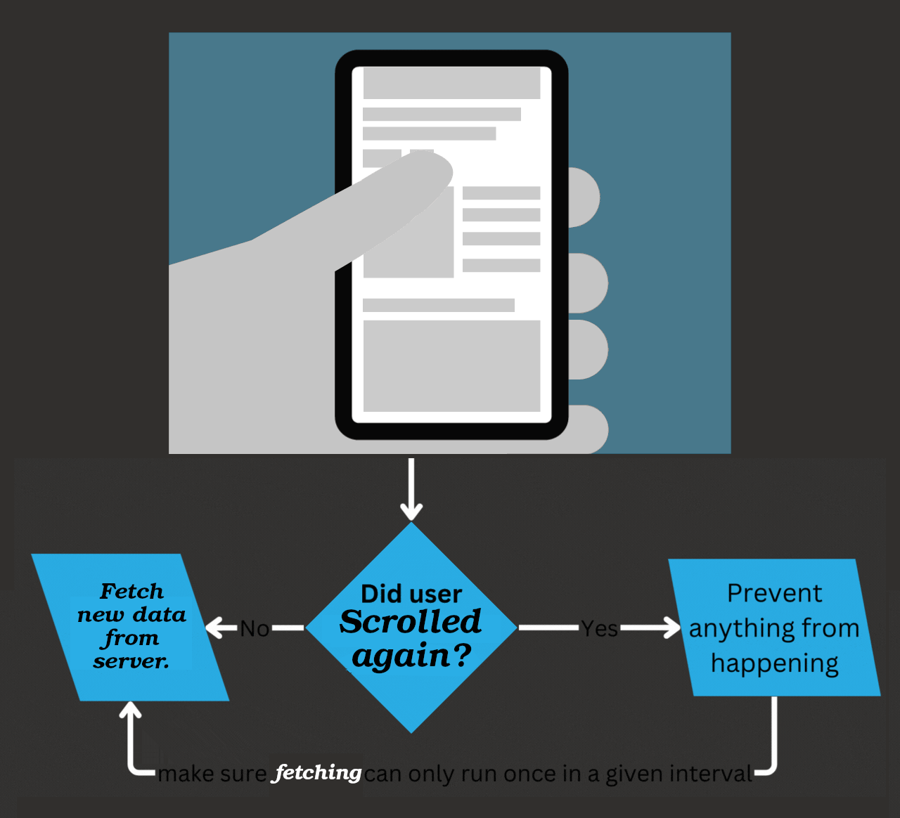

# Server components

- A new type of Component.
- Renders ahead of time, before bundling, in an environment separate from your client app or SSR server.
- This separate environment is the "server" in ReactJS server components.
- Can run:
  - **Once** at build time on your CI server.
  - **For each request** using a web server.
- A web server is not required: can run at build time to read from the filesystem or fetch static content.
  <table>
    <thead>
      <tr>
        <th></th>
        <th>Code</th>
        <th>Details</th>
      </tr>
    </thead>
    <tbody>
      <tr>
        <th>Old school way of rendering a static</th>
        <td>
          https://github.com/kasir-barati/react/blob/8efc350e45b96421d8025b6b0fd4dd07148c7b47/.github/docs/examples/fetch-and-render-static-data.jsx#L1-L15
        </td>
        <td>
          Extra 75K download size for libraries to generate html from markdown + rerender caused by setting the state in <code>useEffect</code>!
        </td>
      </tr>
      <tr>
        <th>Server component</th>
        <td>
          https://github.com/kasir-barati/react/blob/8efc350e45b96421d8025b6b0fd4dd07148c7b47/.github/docs/examples/server-compoent.jsx#L1-L10
        </td>
        <td>
          No extra 75K download size since it was done one the server during the build + no rerender!
        </td>
      </tr>
      <tr><td colspan="3"></td></tr>
      <tr>
        <th>Old fashion</th>
        <td>
          https://github.com/kasir-barati/react/blob/8dc37ddc47444869cf4008858bf5a107d33f6ac9/.github/docs/examples/note-author-client-side-component.jsx#L1-L32
        </td>
        <td>
          We have an expensive <a href="./fetching-data.md#fetchingDataNetworkWaterfall">"network waterfall"</a>.
        </td>
      </tr>
      <tr>
        <th>Server component</th>
        <td>
          https://github.com/kasir-barati/react/blob/8dc37ddc47444869cf4008858bf5a107d33f6ac9/.github/docs/examples/note-author-server-component.jsx#L1-L21
        </td>
        <td>
          Your client will only receive HTML, so it is perfectly fine for you to connect to your database directly, and your client cannot see the credentials used at all.
        </td>
      </tr>
    </tbody>
  </table>
- Can dynamically refetch data from a server, where they can access the data and render again.
  - New application architecture.
  - Combination of the:
    - Simple "request/response" mental model of server-centric Multi-Page Apps.
    - Seamless interactivity of client-centric Single-Page Apps.
- Can **NOT** use interactive APIs like `useState`.
- To add interactivity to server components add `"use client"` directive at the top of your server component.

  In the following example:

  - `Notes` is a server component.
  - `Expandable` is a client component used inside `Notes`.

  <table>
    <thead>
      <tr>
        <th>Server component</th>
        <th>Client component</th>
      </tr>
    </thead>
    <tbody>
      <tr>
        <td>
          https://github.com/kasir-barati/react/blob/5eb007ae775ac8f12959b83a373dba624e7c16e8/.github/docs/examples/notes-server-component.jsx#L1-L15
        </td>
        <td>
          https://github.com/kasir-barati/react/blob/5eb007ae775ac8f12959b83a373dba624e7c16e8/.github/docs/examples/expandable-client-omponent.jsx#L1-L14
        </td>
      </tr>
    </tbody>
  </table>

  This is how we can add interactivity + having merits of server component at the same time;

  1. Render `Notes`.
  2. Bundler creates a bundle for the `Expandable` client component with the data prepopulated from the `Notes` (a server component).

- When you `await` in an async component (AKA server component), ReactJS will **suspend** and wait for the promise to resolve before resuming rendering.
- Streaming support for [Suspense](#suspense):

  This means that we can specify:

  - Which parts (important) have to loaded before we want to replace the spinner with content.
  - Which parts (not so important) can be delayed and will be replaced in the near future with data.

  ```jsx
  // Page.tsx
  import { Suspense } from 'react';
  import { Comments } from './Comments';
  import api from './api';

  async function Page({ id }: { id: string }) {
    // Will suspend the Server Component.
    const note = await api.notes.get(id);
    // NOTE: not awaited, will start here and await on the client.
    const commentsPromise = api.comments.get(note.id);

    return (
      <div>
        {note}
        <Suspense fallback={<p>Loading Comments...</p>}>
          <Comments commentsPromise={commentsPromise} />
        </Suspense>
      </div>
    );
  }

  // Comments.tsx
  ('use client');
  import { use } from 'react';

  function Comments({ commentsPromise }) {
    // NOTE: this will resume the promise from the server.
    // It will suspend until the data is available.
    // Since async components are not supported on the client, we await the promise with use.
    const comments = use(commentsPromise);

    return comments.map((comment) => <p>{comment}</p>);
  }
  ```

## Suspense

```tsx
<Suspense fallback={<Loading />}>
  <SomeComponent />
</Suspense>
```

- A new feature in ReactJS.
- Lets you display a fallback until its children have finished loading.
- Here `children` is the actual UI you intend to render.
  - It is treated as a unit, either it will "reveal" all of them at once after every last one of them was loaded or it just shows you the specified `fallback`.
  - Inside the `children` we can have nested `Suspense`s. So each children will use its closest `Suspense`. Thus creating a loading sequence.
- But if `children` cannot be displayed (it is loading it) ReactJS renders `fallback`. Something like a loading spinner or skeleton.
- Suspense will automatically switch to `fallback` when `children` suspends, and back to `children` when the data is ready.

> [!NOTE]
>
> Only **Suspense-enabled data sources** will activate the Suspense component. They include: [Relay](https://relay.dev/docs/guided-tour/rendering/loading-states/), [NextJS](https://nextjs.org/docs/app/building-your-application/rendering), [`lazy`](#lazy), and experimental [`use` API](https://react.dev/reference/react/use).
>
> Suspense does not detect when data is fetched inside an Effect or event handler. Right now this feature is not fully documented. Thus we need to use frameworks like NextJS.

### How `Suspense` works

It allows components to interrupt or "suspend" rendering in order to wait for some asynchronous resource (such as code, images or data) to be loaded.

1. When a component "suspends", it indicates to ReactJS that the component is not "ready" to be rendered yet, and won't be until the asynchronous resource it's waiting for is loaded.
2. When the resource finally loads, ReactJS will try to render the component again.

### What kind of problem does it solve?

Prevent accidental flickering of loading elements (such as spinners), which can commonly occur when loading sequences are not explicitly designed and coordinated.

### When to use them?

- Do **NOT** put a `Suspense` boundary around every component.
- `Suspense` boundaries should not be more granular than the loading sequence that you want the user to experience.
- Your UI/UX designer will tell you where the loading states should be placed -- it is likely that they've already included them in their design wireframes.

> [!NOTE]
>
> A common alternative UI pattern for when user is interacting with our ReactJS app is to defer updating and to keep showing the previous results until the new results are ready. Imagine, in a search box:
>
> 1. Your user type something.
> 2. You retrieve something from backend.
> 3. You show the suggestions.
> 4. User continues typing.
>
>    - Now we could again show a loading spinner.
>    - Or just keep the old data, `useDeferredValue` hook lets you pass a deferred version of the query down.
>
>      ```tsx
>      import { useDeferredValue, useState } from 'react';
>
>      export default function App() {
>        const [query, setQuery] = useState('');
>        const deferredQuery = useDeferredValue(query);
>
>        return (
>          <>
>            <p>
>              <label htmlFor="search">Search</label>
>              <input
>                id="search"
>                type="search"
>                value={query}
>                onChange={(e) => setQuery(e.target.value)}
>              />
>            </p>
>            <Suspense fallback={<h2>Loading...</h2>}>
>              <SearchResults query={deferredQuery} />
>            </Suspense>
>          </>
>        );
>      }
>      ```
>
>      To help user distinguishes between "stale results" and "search results" you can send a flag to `SearchResults` component based on whether `query !== deferredQuery` and there add some CSS stylistic rules: `<SearchResults isStale={query !== deferredQuery} query={deferredQuery} />`

### `startTransition`

- Tells ReactJS that the state transition is not urgent.
- This can be considered some sort of concurrent rendering:
- It's better to keep showing the previous page/state instead of hiding any already revealed content.
- In a typical ReactJS app, most updates are conceptually transition updates.

  > [!NOTE]
  >
  > For backward compatibility ReactJS still treats all updates as urgent unless you say that it is a transition.

- Your app feels so much snappier and more responsive to the user.
  - Can pause rendering something (a _transition_) and switch to something far more important (a non-transition task).
  - No more continuing to render an outdated state (e.g. the thing that is marked as _transition_ might rely on some other states and those states were changed during its transition. Under this circumstances ReactJS will update those states that were not marked as _transition_ and then when it comes back to this half done state _transition_ it will simply throw it away and start again!).

> [!NOTE]
>
> A Transition does not wait for all content to load. It only waits long enough to avoid hiding already revealed content.

#### Scenarios

1. Imagine you've got a page and there you have this beautiful button and header, when you click on the button you wanna see your bio, but the thing is that you've wrapped your whole app with a big spinner, therefore after clicking on that button you're whole page is gonna be replaced with that spinner. A [jarring](https://dictionary.cambridge.org/dictionary/english/jarring) UX.
2. User initiates an action that would trigger a component to update, such as a search that fetches a ton of new data to display, the whole page would just kind of hang while all that loading stuff was happening.

3. <figure>
     
     <figcaption>
       Trying to search for a particular city in a large list of data. As it is show in the virtual keyboard, although we're still typing our input field stopped being responsive.
     </figcaption>
   </figure>

##### Solutions

Here we discuss how we can optimize our ReactJS app for the 3rd scenario:

- <a id="debouncingSolution" href="#debouncingSolution">#</a> To do [debouncing](https://www.youtube.com/watch?v=F2zF8fu7aG0);

  

- <a id="throttlingSolution" href="#throttlingSolution">#</a> To throttle.

  

- Design some UIs (with [skeleton UI](https://www.npmjs.com/package/@skeletonlabs/skeleton)) that would change the UI in a way to feel faster.
- But now we have `startTransition` to help us in this endeavour.

#### The logic behind its name

A first-class animation API integrated with `startTransition`:


#### How to use it

1. Wrap you non-important task in a `startTransition`:
   ```tsx
   import { useTransition } from 'react';
   // ...
   const [isPending, startTransition] = useTransition();
   // ...
   onChange = (e) => {
     const value = e.target.value;
     startTransition(() => {
       nonUrgentAction(value);
     });
   };
   ```

#### Real world examples

- [GitHub, ReactJS 18 working group, discussion 65](https://github.com/reactwg/react-18/discussions/65)
- And [here](../../src/components/search/NormalSearch.component.tsx#L21) you can see we have a setter which we call it every time user type something in the `input`, so let's fix it:

  1. <a id="debounceWithSetTimeout" href="#debounceWithSetTimeout">#</a> First we are gonna explore debouncing technique. You can see the entire code [here](../../src/components/search/DebouncingSearch.component.tsx):

     First we need to have a ref to our `setTimeout`. We will use it later to cancel previously registered filters.

     https://github.com/kasir-barati/react/blob/da0252c94b81d3e4abe4ae5f8d56832f448d1d03/src/components/search/DebouncingSearch.component.tsx#L10

     Here before registering a new filter operation we wanna cancel the one before it using ref.

     https://github.com/kasir-barati/react/blob/da0252c94b81d3e4abe4ae5f8d56832f448d1d03/src/components/search/DebouncingSearch.component.tsx#L15

     And here we are queuing a filter operation to start in 500 milliseconds. And if in the meantime user start typing again we cancel the one that was queued and queue a new one with the updated value.

     https://github.com/kasir-barati/react/blob/da0252c94b81d3e4abe4ae5f8d56832f448d1d03/src/components/search/DebouncingSearch.component.tsx#L23-L29

  2. <a id="aRealWorldExampleOfLodashDebouncing" href="#aRealWorldExampleOfLodashDebouncing">#</a> You can use `Lodash.debounce` too like we did [here](../../src/components/search/LodashDebounceSearch.component.tsx).

     > [!CAUTION]
     >
     > 1. Our codebase is kinda getting too complicated for a simple filter!
     > 2. It might look a bit weird at first when you read a code like this:
     >
     >    https://github.com/kasir-barati/react/blob/dbf90a9e13c82b319b3d19870e8d61ba7cfacb4b/src/components/search/LodashDebounceSearch.component.tsx#L17-L29
     >
     >    **We are calling debounce function** and it returns a new debounced function. **And that's fine** and works as we expect it too because of what we've explained [here](./hooks.md#useCallbackWillNotPreventFunctionCreation).
     >
     >    You can try to remove `useCallback`, then type "Tokyo" really fast or whatever and see the logs. It will log "I will be called only once every 1500ms!" several times (in fact it is gonna be equivalent to how many times you pressed a key down on your keyboard!)

- <a id="infiniteScrollFeedExample" href="#infiniteScrollFeedExample">#</a> In a social media feed or ECommerce product gallery where users can keep scrolling to load more content.

  You want to load data only when users are close to the bottom of the page, but doing so efficiently can be challenging due to constant scroll events. This can be solved either with:

  1. [Throttling](#throttlingSolution).

     With [Lodash.throttle](https://www.npmjs.com/package/lodash.throttle).

  2. [Debouncing](#debouncingSolution).
  3. Using [Intersection Observer](./intersection-observer.md).

## `lazy`

- Lets you defer loading component's code until it is rendered for the first time.
  - In other word we can dynamically import a component and defer loading its code until the component is needed.
  - Smaller bundles, loaded only when necessary.
- Optimizes the initial loading time.
- [A very different use case of `lazy`](../../src/components/artists/Artists.component.tsx).

### How ReactJS deals with `lazy`

1. Call `lazy` outside your components to declare a lazy-loaded React component:

   ```tsx
   import { lazy } from 'react';
   // ...
   const MarkdownPreview = lazy(
     () => import('./MarkdownPreview.component.tsx'),
   );
   // ...
   ```

   A callback function which returns a [Promise](https://developer.mozilla.org/en-US/docs/Web/JavaScript/Reference/Global_Objects/Promise). Or a promise-like object.

   > [!CAUTION]
   >
   > This assume that your `MarkdownPreview.component.tsx` is using default export ([read this to learn more](./components.md#default-vs-named-exports)).
   >
   > In other word your component callback should return a promise whit this signature where the default property is a valid ReactJS component:
   >
   > ```tsx
   > Promise<{ default(): T }>;
   > ```

2. Will not call the specified callback until the first time you attempt to render the returned component.
3. Calls your component for the first time.
4. Will wait for it to resolve.
5. Renders what your `default` method returns.
6. Caches the resolved value.

> [!TIP]
>
> While ReactJS is loading it you can use [`Suspense`](#suspense) to load a [spinner](../../src/components/loading-spinner/LoadingSpinner.component.tsx).

### Don'ts

- Do not declare `lazy` components inside other components:

  ```tsx
  import { lazy } from 'react';

  function Editor() {
    // Bad idea, this will cause all state to be reset on re-renders
    const MarkdownPreview = lazy(
      () => import('./MarkdownPreview.js'),
    );
    // ...
  }
  ```

## Examples of `lazy` and `Suspense`

- [Post](../../src/components/post/), try to import it in [`App.tsx`](../../src/App.tsx) and run the app to see how it works.
