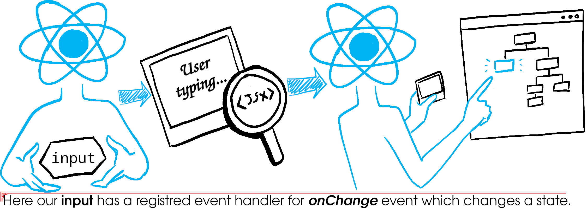

# State

- Components often need to change what's on the screen as a result of an interaction.
- A component can store some information.
- Component-specific memory: typing into the form, clicking "next" on an image carousel, etc.
- For this we use [`useState` hook](./hooks.md#usestate).
- Behaves more like a snapshot and not regular JS variables.
- Fully private to the component declaring it.
- Changing it triggers a rerender.

  > [!CAUTION]
  >
  > These two codes are equivalent:
  >
  > | Calling state setter function 3 times                                                                                            | Calling state setter function 1 time                                                                                             |
  > | -------------------------------------------------------------------------------------------------------------------------------- | -------------------------------------------------------------------------------------------------------------------------------- |
  > | https://github.com/kasir-barati/react/blob/8b38df8c598c4c06c5b47152ecb30c0ec205cbff/.github/docs/examples/handle-click1.js#L1-L5 | https://github.com/kasir-barati/react/blob/8b38df8c598c4c06c5b47152ecb30c0ec205cbff/.github/docs/examples/handle-click2.js#L1-L3 |
  >
  > What is happening here is that when we are calling `setCount` three times in a row it will use that render's count value and not the updated one. Remember each time you call a setter state function it will rerender your component.

- Numbers, strings, and booleans are immutable/read-only.

  ```ts
  const [num, setNum] = useState(1);
  // ...
  setNum(10); // this cannot change the value of num
  ```

## Update states which are array/object

- To update array/object states make sure to use [spread operator](https://developer.mozilla.org/en-US/docs/Web/JavaScript/Reference/Operators/Spread_syntax) or just pass a new array/object.
- Libs like redux use [immer](https://github.com/immerjs/use-immer) to reduce the burden of this tedious work.

```ts
updatePerson((draft) => {
  draft.artwork.city = 'Lagos';
});
```

### Objects

```ts
const [position, setPosition] = useState({ x: 0, y: 0 });
// ...
position.x = 5; // possible but not valid. ReactJS won't rerender the component.
```

Without using the state setting function, React has no idea that object has changed. But note that this style of using setter function won't work either:

```ts
onPointerMove={(e) => {
  position.x = e.clientX;
  position.y = e.clientY;
  setPosition(position); // You need to create a fresh object
}}
```

Another important aspect is to keep in mind that the spread syntax performs "shallow" copy. Meaning, for nested objects you need use it again;

```ts
const [person, setPerson] = useState({
  name: 'Yuki',
  artwork: {
    title: 'Blue dragon',
    city: 'Kyoto',
    image: 'https://i.imgur.com/zGDdKKR.jpeg',
  }
});
// ...
setPerson({
  ...person, // Copy other fields
  artwork: { // but replace the artwork
    ...person.artwork // Copy other fields of artwork
    title: e.target.value, // but change the title.
  },
})
```

### Array

|           | avoid (mutates the array)           | prefer (returns a new array) |
| --------- | ----------------------------------- | ---------------------------- |
| adding    | `push`, `unshift`                   | `concat`, [...arr]           |
| removing  | `pop`, `shift`, `splice`            | `filter`, `slice`            |
| replacing | `splice`, `arr[i] = ...` assignment | `map`                        |
| sorting   | `reverse`, `sort`                   | copy the array first         |

> [CAUTION]
>
> - `slice` lets you copy an array or a part of it.
> - `splice` mutates the array (to insert or delete items).

- This is how you can simulate `unshift`:

  ```ts
  setArtists([{ id: nextId++, name: name }, ...artists]);
  ```

- This is how you can simulate `push`:

  ```ts
  setArtists([...artists, { id: nextId++, name: name }]);
  ```

- Combine `slice` and spread operator to insert at a specific index:

  ```ts
  setArtists([
    // Items before the insertion point:
    ...artists.slice(0, insertAt),
    // New item:
    { id: nextId++, name: name },
    // Items after the insertion point:
    ...artists.slice(insertAt),
  ]);
  ```

- Sorting and reversing:

  ```ts
  const nextList = [...list];
  nextList.reverse();
  // nextList.sort();
  setList(nextList);
  ```

> [!CAUTION]
>
> If your state is an array of objects, and if you copy it using spread operator, you can’t mutate existing items inside of it directly. Remember it is still a shallow copy, thus the objects are referring to the same address on RAM.

> [!TIP]
>
> Generally, you shouldn’t need to update state more than a couple of levels deep. If your state objects are very deep, you might want to restructure them differently so that they are flat.

## How ReactJS know which state should be returned

- ReactJS Does not rely on some magic like parsing your code in order to know which state is related to which variable.
- Instead it relies on the call order. **This is the very reason why you cannot have conditional hooks** :).
- ReactJS internally:
  1. Stores each component's states in [an array](https://github.com/kasir-barati/react/blob/main/.github/docs/examples/use-state-simulation.html#L24): `globalComponentHooks` in our simulation.
  2. And with each `useState` call it will return [the current index's state](https://github.com/kasir-barati/react/blob/main/.github/docs/examples/use-state-simulation.html#L23): `globalCurrentHookIndex` in our simulation.
  3. And increment the index by one: `globalCurrentHookIndex++`.

> [!TIP]
>
> See [this HTML markup + JS script](./examples/use-state-simulation.html) to grasp better how ReactJS is working with states.

## Rendering & states relationship

- "Rendering" means that ReactJS is calling your component.
- Your component returns a JSX;

  - A snapshot of the UI in time:

    These will be calculated using component's state at the time of the render:

    - Props.
    - Event handlers.
    - Local variables



### An example on how this can affect you

Here's a little example to show you how this might cause you confusion. In this example, by clicking on the "+3" button you might expect it to increment the counter 3 times. ~~Because it calls `setNumber(number + 1)` three times~~ :x:.


> [!CAUTION]
>
> **Setting state only changes it for the next render**. So basically ReactJS prepares to change number to 1 on the next render after each time we call `setNumber`. **ReactJS waits until all code in the event handlers has run before processing your state updates**.
>
> Like a waiter at a restaurant, they do not run to the kitchen at the mention of your first dish! Instead, they let you finish your order, let you make changes to it, and even take orders from other people at the table.
>
> - Instead of too many rerenders, ReactJS **batch** them.
> - **ReactJS does not batch across multiple intentional events like clicks** -- each click is handled separately.
>
> And when it rerenders and we click again this is what will happen again:
>
> ```ts
> setNumber(1 + 1);
> setNumber(1 + 1);
> setNumber(1 + 1);
> ```
>
> Note that even if we set a timer (`setTimeout`) it won't solve the issue. As you know JS keeps track of outer variables before it registers a callback. This is what commonly referred to as [closure](https://developer.mozilla.org/en-US/docs/Web/JavaScript/Closures).
>
> **Fix**: you could do something like this instead.
>
> ```ts
> setNumber((n) => n + 1);
> setNumber((n) => n + 1);
> setNumber((n) => n + 1);
> ```
>
> You're passing a function that calculates the next state based on the previous one in the queue;
>
> 1. ReactJS queues this function to be processed after all the other code in the event handler has run.
> 2. During the next render, ReactJS goes through the queue and gives you the final updated state.
>
> | queued update | `n` | returns     |
> | ------------- | --- | ----------- |
> | `n => n + 1`  | `0` | `0 + 1 = 1` |
> | `n => n + 1`  | `1` | `1 + 1 = 2` |
> | `n => n + 1`  | `2` | `2 + 1 = 3` |
>
> **Replacing VS queueing**
>
> Imaging you change the event handler to this:
>
> ```ts
> setNumber(number + 5);
> setNumber((n) => n + 1);
> ```
>
> | queued update    | `n`              | returns     |
> | ---------------- | ---------------- | ----------- |
> | "replace with 5" | `0` (**unused**) | `5`         |
> | `n => n + 1`     | `5`              | `5 + 1 = 6` |
>
> So in other word these two are equivalent: `setNumber(n => 5)` and `setNumber(5)`.

> [!TIP]
>
> Updater functions must be [pure](./components.md#pure-components). **DO NOT**:
>
> - Update another state inside an updater function.
> - No side effect either.

#### Naming convention for updater function <ins>argument</ins>

- Use first letters of the corresponding state variable:

  ```ts
  setEnabled((e) => !e);
  setLastName((ln) => ln.reverse());
  setFriendCount((fc) => fc * 2);
  ```

- Another approach is the full state variable name:

  ```ts
  setEnabled((enabled) => !enabled);
  ```

- And lastly, use a prefix:

  ```ts
  setLastName((prevLastName) => prevLastName.reverse());
  ```

#### Calculating final state pseudo code

```ts
type fn = (prevState: number) => number;
export function getFinalState(
  baseState: number,
  queue: Array<number | fn>,
) {
  let finalState = baseState;
  for (const q of queue) {
    if (isNumber(q)) {
      finalState = q;
    } else {
      finalState = q(finalState);
    }
  }
  return finalState;
}
function isNumber(n: unknown): n is number {
  return Number.isFinite(n) ? true : false;
}
```

## Choosing the State Structure

- Have multiple state variables if their state is unrelated.
- If you find that you often change two state variables together, it might be easier to combine them into one.

## Lifting state up

- Sharing state between multiple components.
