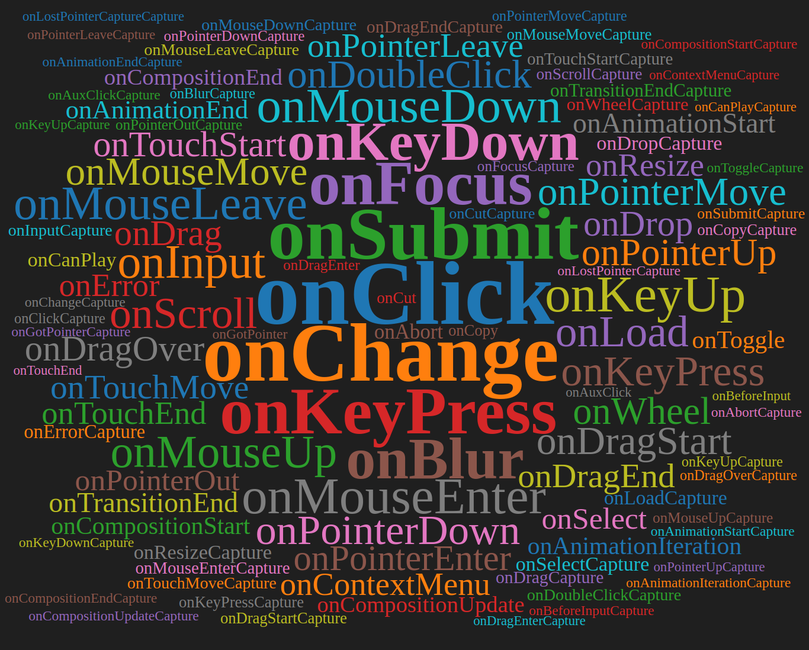
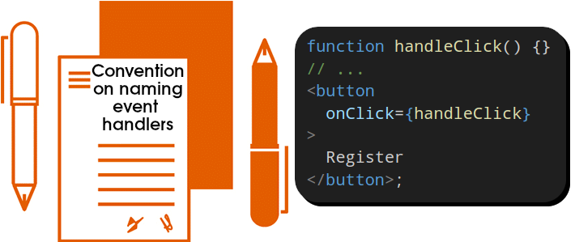
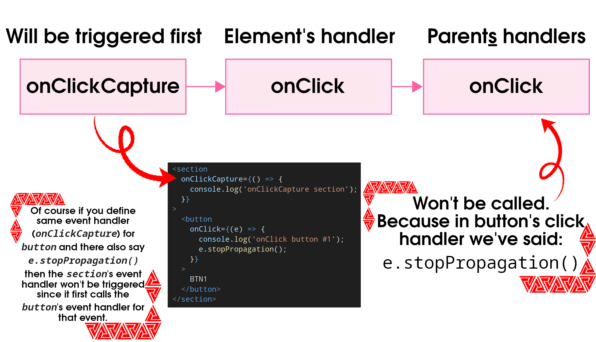

# Events



- Functions that will be triggered **in response to user interactions** (clicking, hovering, focusing on form inputs, and so on).

  > [!IMPORTANT]
  >
  > In other word, for our ReactJS web app to react to the event, we need to update the [state](./state.md).

- HTML elements such as `button` only support built-in browser events like `onClick`.
- Custom components written by us can have any application-specific names as their event handler props:

  ```tsx
  <Toolbar
    onTwitterShare={() => {
      // ...
    }}
    onDownloadImage={() => {
      // ...
    }}
  />
  ```

- **Event handler naming convention**: `handle` followed by the event name.

  

> [!CAUTION]
>
> **DO NOT** call event handlers, just pass it:
>
> | Correct                                   | Incorrect                                   |
> | ----------------------------------------- | ------------------------------------------- |
> | `` | `` |
> | ` alert("1")} />` | ``         |
>
> The difference is subtle:
>
> - The first one registers the a handler for mouse enter event.
> - The second one calls `handleMouseEnter`/`alert` function every time the component renders.

- **Event handler props naming convention**: `on`, followed by a event name. The same as browser event names; `onClick`, `onMouseEnter`, etc.
- When we have a [design system](https://www.figma.com/blog/design-systems-101-what-is-a-design-system/), our common components have their styles defined according to the design system but their behavior will be defined by the components in which they are being imported and used.

## Event propagation

- An event “bubbles” or “propagates” up the tree:

  1. It starts with where the event happened.
  2. Then it goes up the tree.

  ```tsx
  <section
    className="Toolbar"
    onClick={() => {
      alert('And then this one!');
    }}
  >
    <button
      onClick={() => alert('This alert will be executed first!')}
    >
      Play Movie
    </button>
  </section>
  ```

  > [!IMPORTANT]
  >
  > `onScroll` only works on the JSX tag you attach it to. It will **NOT** propagate.

- Event handlers receive an `event` object as their only argument. call `e.stopPropagation()` to stop the propagation: ` { e.stopPropagation(); }} />`.

  > [!IMPORTANT]
  >
  > You can by pass the `e.stopPropagation()` and still capture the event even if the child component stops propagation by using `*Capture` event; `onClickCapture`.
  >
  > Useful for scenarios like analytics.

  

- Utilize `e.preventDefault` to prevent default behaviors, e.g. in after a submit button is clicked browser will reload the page, but if we wanted to we can prevent that from happening.

  ```tsx
  export default function Signup() {
    return (
      <form
        onSubmit={(e) => {
          e.preventDefault();
          alert('Submitting!');
        }}
      >
        <input type="text" />
        <button type="submit">Send</button>
      </form>
    );
  }
  ```
